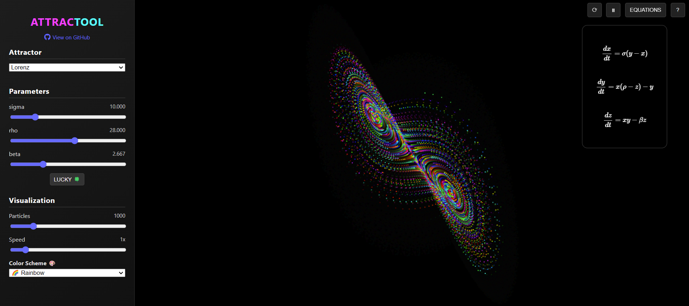

# ATTRACTOOL

**ATTRACTOOL** is a dynamic visualization tool for exploring **chaotic attractors** with customizable parameters, interactive controls, and more.

---

## Features
- **Explore Chaotic Attractors**: 
  - Lorenz
  - Rössler
  - Halvorsen
  - Chen
  - Aizawa
  - Dadras
- **Color Schemes**: 
  - 🌈 Rainbow
  - 🔥 Fire
  - ❄️ Cool
  - ⚡ Neon
  - 🧁 Pastel
  - ⚫ Grayscale
  - 💜 Cyberpunk
- **Customizable Parameters**: Adjust equations and visualization settings in real-time.
- **Interactive Controls**: Rotate, zoom, modify simulations with keyboard, mouse, or touch.

---

## Usage
- Use the sidebar to select attractors, adjust parameters, and switch themes.
- Interact with the canvas:
  - **Drag**: Rotate view
  - **Scroll/Pinch**: Zoom
  - **Keyboard**: Adjust parameters (`↑ ↓ → ←`), pause (`Space`), reset (`Enter`).
- Access equations and help via top-bar buttons.

## Acknowledgements
This project uses:
- [MathJax](https://www.mathjax.org/) for equations rendering.
- [Font Awesome](https://fontawesome.com/) for icons.

## License
This project is licensed under the [MIT License](LICENSE).